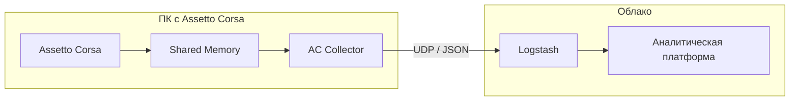

# Собрать данные с автосимулятора: как Assetto Corsa стала источником живых данных

229 заездов, 140 разных пилотов, 28 часов 4 минуты и 53 секунды непрерывной работы за три дня. Никто не пострадал. Почти. Зато мы получили отличный поток данных.

Как фанат Формулы-1, хочу поделиться демо-кейсом сбора гоночной телеметрии из симулятора **Assetto Corsa**, который мы использовали во время проведения [SOC Forum 2025](https://forumsoc.ru/). 

## Зеленый свет

На форуме у нас был стенд с классическим набором: лекторий, мерч, разговоры про безопасность и аналитику. Но был и козырь в рукаве — **гоночный симулятор** с подвижной платформой. 

Все гости форума могли в порядке живой очереди собрать быстрый круг на автомобилях классов **GT3** и **GT4** по самым популярным трассам мира: Сильверстоун, Монца, Нюрбургринг и другим. И да, очередь к симулятору собиралась быстрее, чем к кофе-брейку.

[Гоночный симулятор на стенде](https://github.com/kiliandark/assetto-corsa-telemetry-collector/blob/main/img/sim.jpg?raw=true)

## Что из себя представлял симулятор

С технической стороны это был полноценный автосимулятор: игровой ПК с **Assetto Corsa** (2014), кокпит для симрейсинга (руль с педалями, кресло и подвижная платформа). Софт состоял из самой игры и нашей программы для чтения телеметрии (далее — коллектор).

**Assetto Corsa** была выбрана не случайно. Игра старая, но с огромным комьюнити и открытой архитектурой. К ней написаны огромное количество модов и библиотек, а значит шанс быстро интегрироваться был высоким.

[Моды Assetto Corsa](https://github.com/kiliandark/assetto-corsa-telemetry-collector/blob/main/img/2106.png?raw=true)

## Зачем понадобилась аналитика 

Идея была показать возможности платформы анализа данных [Smart Monitor](https://smartmonitor.ru/ru/) (далее — аналитическая платформа) в интерактивном формате. Не логами ради логов, а потоком телеметрии в live-режиме, который реально что-то отражает.

Во время заезда каждую секунду генерируются десятки параметров: скорость, обороты двигателя, положение автомобиля, работа подвески, состояние шин, ошибки пилота.

Задача была следующей:
1) получать телеметрию из **Assetto Corsa** в реальном времени
2) отправлять ее в аналитическую платформу
3) сразу же выводить информацию на заранее подготовленные дашборды аналитики заездов
4) сделать все достаточно надежным, чтобы работало три дня подряд на форуме без остановки симулятора

## Как мы подошли к сбору данных

Как упоминалось выше, **Assetto Corsa** игра не новая, однако за счет модинга вокруг нее давно выросло сообщество. Оказалось, что существует несколько способов забрать телеметрию ([ACTI](https://www.overtake.gg/downloads/acti–assetto–corsa–telemetry–interface.3948/), [Simhub](https://www.simhubdash.com/)), но нам они не подошли. `ACTI` формирует данные только после окончания сессии, использует бинарные форматы и требует ручной обработки, а `SimHub` не умеет передавать телеметрию в реальном времени для первой **Assetto Corsa** (2014) в отличие от второй части **Assetto Corsa Competizione** (2019) или других гоночных симуляторов.

В итоге мы остановились на чтении данных из **Shared Memory** (*выделенная область оперативной памяти, через которую игра передает текущие показатели стороннему софту в режиме реального времени*). Более подробно о выборе способа сбора данных рассказал мой коллега в своей [статье](https://habr.com/ru/articles/973024/).

Мы взяли [библиотеку для работы с Shared Memory](https://github.com/mdjarv/assettocorsasharedmemory), доработали её и написали свой коллектор. Его задача была c определенной периодичностью читать текущие значения и отправлять их дальше в виде `JSON`.

## Архитектура 

На ПК с **Assetto Corsa** работал коллектор на `C#`. Он раз в секунду читал данные из **Shared Memory**, сериализовал их в `JSON` и отправлял по `UDP` на хост с Logstash. 
Прием и обработка телеметрии были реализованы следующим пайплайном Logstash:

```cs
input {
  udp {
    port => 123 #порт, который указан в коллекторе
  }
}

filter {
  json {
    source => "message"
  }
  mutate {
    remove_field => ["message", "host"]
  }
}

output {
  opensearch {
    hosts => ["https://веб:9200"]
    index => "ac_telemetry"
    user => "logstash"
    password => "${ES_PWD}"
    ssl => true
    cacert => "/app/logstash/config/ca-cert.pem"
    ecs_compatibility => "disabled"
  }
}
```
Logstash принимал сырую телеметрию, разбирал `JSON` и отправлял готовые индексы в аналитическую платформу.

Вся логика выглядела так:



Критически важным для нас было добиться мгновенной отправки данных. Пока пилот проезжает круг, данные уже на дашборде.
Такой подход оказался достаточно устойчивым: система пережила за три дня форума десятки перезапусков игры, смену пилотов и трасс, но ручного вмешательства не потребовалось.

## Периодичность сбора и обзор данных

**Assetto Corsa** отдает телеметрию с очень высокой детализацией. В максимальной конфигурации данные можно читать с частотой десятки раз в секунду, вплоть до частоты игрового тика. Для нашего кейса такая детализация была избыточна:

```cs
// Интервалы обновления
ac.StaticInfoInterval = 10000; // 10 сек
ac.GraphicsInterval = 10000;   // 10 сек
ac.PhysicsInterval = 1000;     // 1 сек
```

Этого оказалось более чем достаточно для аналитики развлекательных заездов и расчета ачивок.

Телеметрия разделена на три логических блока:
- `Static` — информация о сессии: машина, трасса, пилот
- `Graphics` — состояние заезда: круги, сектора, флаги, позиция
- `Physics` — физика автомобиля: скорость, обороты, подвеска, шины, повреждения

**Physics**, в отличие от остальных собирается чаще, поскольку в нем и содержится самая интересная телеметрия. Пример некоторых параметров, которые обновляются каждую секунду:

```cs
public struct Physics
{
    public float Fuel;          // Уровень топлива 
    public int Gear;            // Текущая передача
    public int Rpms;            // Обороты двигателя 
    public float SpeedKmh;      // Скорость 
    public float TyreWear;      // Общий износ шин
    public float CarDamage;     // Общие повреждения автомобиля 
    public float AirTemp;       // Температура воздуха 
    ...
}
```

## Метрики

Каждое событие внутри индекса `ac_telemetry` содержало два блока: сессии и метрики. 
Внутри блока сессии собирались данные из `Static` и `Graphics`, а в блоке метрики исключительно телеметрия из `Physics`.

1. Пример блока сессии:

```json
{
  "session": {
    "short_comment": "Tires Aid: 1,07 (SM)",
    "session_id": 1763644816129,
    "current_sector_index": 2,
    "penalty_time": 0,
    "is_valid_lap": 1,
    "session_time_left": -505.80484,
    "driver": "Anna_Ch",
    "car": "rss_gtm_mercer_v8",
    "icurrent_time": 137.976,
    "flag_type": "Blue_flag",
    "lap_time": 207.347,
    "number_of_laps": 3,
    "session_type": "Practice",
    "position": 1,
    "track": "mugello",
    "completed_laps": 2,
    "best_lap_time": 158.311,
    "track_spline_length": 5197.331
  }
}
```

2. Пример блока метрик:

```json
{
  "metrics": {
    "fuel_level": 45.57421,
    "air_temp": 26,
    "car_damage_front": 0,
    "tyre_temp_i": [
      52.9349,
      53.183594,
      63.83008,
      64.94032
    ],
    "engine_rpm": 6570,
    "gear": 6,
    "speed": 239.38568,
    "tire_temp_middle_rl": 64.607834,
    "road_temp": 36,
    "tyre_wear_rr": 99.993286,
    ...
  }
}      
```

## Дашборды и визуализация заездов

### 1. Дашборд: Текущий заезд

Этот дашборд показывался на большом мониторе рядом с симулятором во время активной сессии и обновлялся в реальном времени. 

Пока пилот проезжал круг, на экране отображались:
- скорость, передача, обороты двигателя
- положение педалей газа и тормоза
- текущий круг, время круга и лучший результат
- состояние шин и повреждения автомобиля
 
[Дашборд: Текущий заезд 1](https://github.com/kiliandark/assetto-corsa-telemetry-collector/blob/main/img/dash_1.PNG?raw=true)

Пилоты часто смотрели на дашборд сразу после финиша круга, сравнивая собственные ощущения за рулем с тем, что происходило «по цифрам».

Нижняя часть дашборда содержит:
- информацию об итоге заезда
- анализ кругов: лучший круг, время каждого круга, валидность круга
- трассу
- графики распределения различных метрик по кругам

[Дашборд: Текущий заезд 2](https://github.com/kiliandark/assetto-corsa-telemetry-collector/blob/main/img/dash_2.PNG?raw=true)

### 2) Дашборд: Сессии и ачивки

Второй дашборд был посвящен **итогам**. Здесь собиралась агрегированная статистика по всем заездам:
- список сессий с фильтрами по пилоту, трассе и машине
- лучшие круги и средняя скорость
- сравнение результатов между участниками

[Дашборд: Сессии и ачивки 1](https://github.com/kiliandark/assetto-corsa-telemetry-collector/blob/main/img/session_1.png?raw=true)

Отдельный блок занимали **ачивки**. Они добавляли элемент соревнования и неожиданно хорошо зашли участникам. **Ачивки** мы делали намеренно полушутливыми. Это был не киберспорт, поэтому строгая спортивная логика здесь была не так важна, как эмоции.

Примеры ачивок:
- «**Амбассадор дрифта**» — большие углы руля на высокой скорости
- «**Ландшафтный дизайнер**» — наибольшее время вне асфальта
- «**Дальнобойщик**» — максимальная суммарная дистанция за день
- «**Макс Ферстаппен**» — максимальная средняя скорость
- «**Владелец таксопарка**» — наибольшее количество разных автомобилей
- «**Любитель дерби**» — наибольшие суммарные повреждения

На дашборде отображался лидер по каждой ачивке. Если пилот удерживал первое место до конца дня, он получал мерч и аплодисменты от зрителей.

[Дашборд: Сессии и ачивки 2](https://github.com/kiliandark/assetto-corsa-telemetry-collector/blob/main/img/session_2.png?raw=true)

## Почему это сработало

Интереснее всего было наблюдать, как люди в очереди начинали следить за результатами других, обсуждать ошибки и спорить. Особенно порадовали фанаты автоспорта: разговоры про траектории, апексы, трейл-брейкинг и оптимальную скорость в поворотах редко можно услышать на форуме кибербезопасности.

С технической точки зрения это был простой поток телеметрии. С точки зрения гостей стенда — полноценный гоночный опыт с аналитикой, статистикой и элементом соревнования. Именно в этой разнице между данными и эмоциями был реализован данный кейс.
